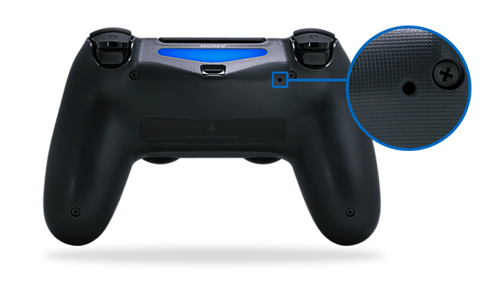

EMULATORS
=========

Last Update : 23:14 27/02/2023

Emulators
---------

- [mame](https://www.mamedev.org)
- [winkawaks](http://www.winkawaks.org)
- [pcsx2](https://pcsx2.net)

PS4 Controllers
---------------

Pair playstation 4 controller:
<kbd>share</kbd>+<kbd>playstation</kbd> (hold 3 secs)

Turn on playstation 4 controller:
<kbd>playstation</kbd>

Turn off playstation 4 controller:
<kbd>share</kbd>+<kbd>playstation</kbd> (hold 8 secs)

Reset the DUALSHOCK®4 to Pair with PS4™
---------------------------------------

### Step 1
Turn off and unplug your PS4™ from the wall or power strip.  
### Step 2
Unplug the power to your router or modem.
### Step 3
Locate the small reset button on the back of the DS4 near the L2 shoulder button

### Step 4
Use a small, unfolded paper-clip or something similar to push the button inside the tiny hole. Hold the button down for roughly 3-5 seconds and release.
### Step 5
Attempt to re-pair the DS4 with the PS4™ by connecting the USB cable from the controller to the console.
### Step 6
Turn on the PS4™, then press the PS button to log into your profile.
### Step 7
The light bar will turn blue indicating the DS4 has paired.

PCSX2
=====

Burnout 3: Takedown
-------------------

- [pcsx2 issues](https://github.com/PCSX2/pcsx2/issues/1415)
- [burnout 3 bug](https://imgur.com/a/gi6Rb)
- [burnout 3 wiki](https://wiki.pcsx2.net/index.php/Burnout_3:_Takedown)

### Black Sky / Shattered Car Window Effect is Missing
Workaround: Switch to software mode (F9 button), load an event, and then switch back to hardware mode (F9 button again).

ROM FAQ
=======

ROM archives
------------

- [coolrom.com](http://coolrom.com)
- [download](http://coolrom.com/dlpop.php?id=41380)

- [emurom.net](https://www.emurom.net)
- [planetemu.net](http://www.planetemu.net)

- [arcadehits.net](http://www.arcadehits.net)
- [emuparadise.me](https://www.emuparadise.me)

Standard Codes
--------------

|  code  |       value        |
|--------|--------------------|
| [a]    | Alternate          |
| [b]    | Bad Dump           |
| [BF]   | Bug Fix            |
| [c]    | Cracked            |
| [f]    | Other Fix          |
| [h]    | Hack               |
| [o]    | Overdump           |
| [p]    | Pirate             |
| [t]    | Trained            |
| [T]    | Translation        |
| (Unl)  | Unlicensed         |
| [x]    | Bad Checksum       |
| ZZZ_   | Unclassified       |
| [!]    | Verified Good Dump |
| (???k) | ROM Size           |

Special Codes
-------------

|  code  |             value              |
|--------|--------------------------------|
| [C]    | Color GameBoy                  |
| [S]    | Super GameBoy                  |
| (M#)   | Multilanguage (# of Languages) |
| [M]    | Mono Only (NeoGeo Pocket)      |
| (PC10) | PlayChoice 10 (NES)            |
| (1)    | Japan (Genesis)                |
| (4)    | USA (Genesis)                  |
| (5)    | NTSC Only (Genesis)            |
| (8)    | PAL Only (Genesis)             |
| (BS)   | BS ROMS (SNES)                 |
| (ST)   | Sufami Turbo (SNES)            |
| (NP)   | Nintendo Power (SNES)          |
| (Adam) | ADAM Version (Coleco)          |
| (PAL)  | PAL Video                      |

Country Codes
-------------

|  code |      value      |
|-------|-----------------|
| (A)   | Australian      |
| (C)   | Chinese         |
| (E)   | Europe          |
| (F)   | French          |
| (FN)  | Finland         |
| (G)   | German          |
| (GR)  | Greece          |
| (HK)  | Hong Kong       |
| (I)   | Italian         |
| (J)   | Japan           |
| (K)   | Korean          |
| (NL)  | Dutch           |
| (PD)  | Public Domain   |
| (S)   | Spanish         |
| (SW)  | Sweden          |
| (U)   | USA             |
| (UK)  | England         |
| (Unk) | Unknown Country |
| (-)   | Unknown Country |
