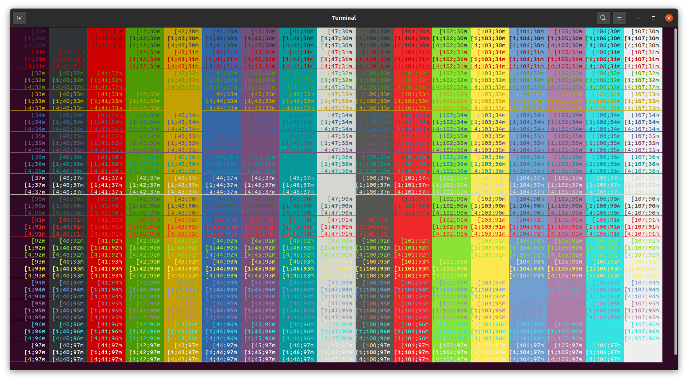
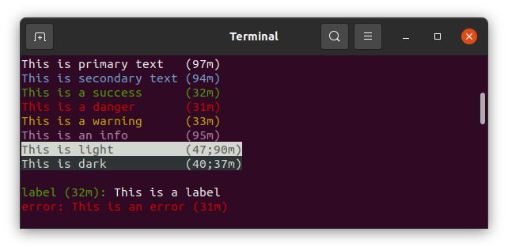
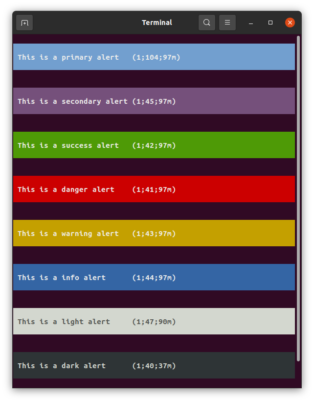
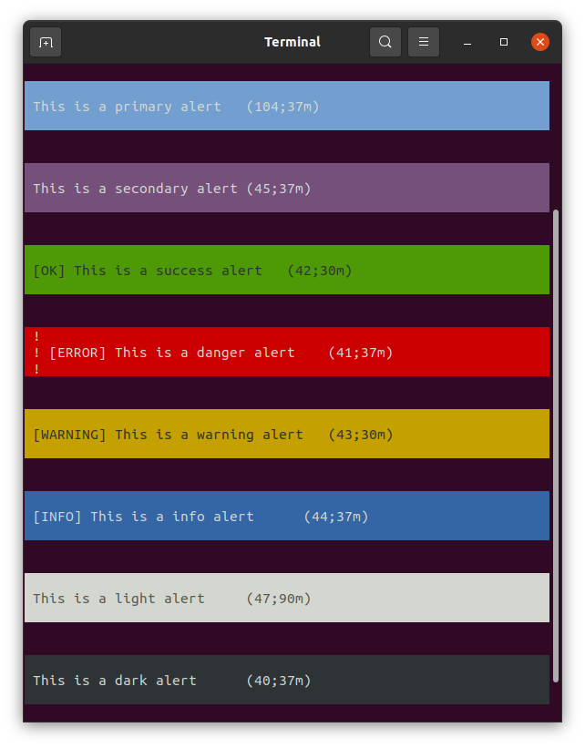
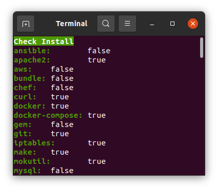

[]((https://github.com/TangoMan75/tools/blob/master/LICENSE))
[](https://github.com/TangoMan75/tools/releases)
[](https://github.com/TangoMan75/tools/stargazers)
[](https://github.com/TangoMan75/tools/actions/workflows/bash_unit.yml)
[](https://github.com/TangoMan75/tools/actions/workflows/shellcheck.yml)


TangoMan Bash Tool
==================


**TangoMan Bash Tools** is an awesome collection of small useful shell scripts.

⏳ TL;DR
--------

1. Copy "tools" folder into your project.
2. Source desired script in your own script.

```bash
source ./tools/src/colors/colors.sh
```

3. Call desired function.
```bash
_echo_info "Hello World !\n"
```

🎯 Features
-----------

**TangoMan Bash Tool** provides the following features:

### ⚡ colors.sh

A semantic set of colors for shell scripts.



Try this in your script :

```bash
#!/bin/bash

CURDIR=$(dirname "$(realpath "${BASH_SOURCE[0]}")")
# shellcheck source=/dev/null
. "${CURDIR}"/tools/src/colors/colors.sh

_echo_primary   'This is primary text'   2 24; echo 'primary'
_echo_secondary 'This is secondary text' 2 24; echo 'secondary'
_echo_success   'This is a success'      2 24; echo 'success'
_echo_danger    'This is a danger'       2 24; echo 'danger'
_echo_warning   'This is a warning'      2 24; echo 'warning'
_echo_info      'This is an info'        2 24; echo 'info'
_echo_light     'This is light'          2 24; echo 'light'
_echo_dark      'This is dark'           2 24; echo 'dark'
```



```bash
#!/bin/bash

CURDIR=$(dirname "$(realpath "${BASH_SOURCE[0]}")")
# shellcheck source=/dev/null
. "${CURDIR}"/tools/src/colors/colors.sh

_alert_primary   'This is a primary alert'
_alert_secondary 'This is a secondary alert'
_alert_success   'This is a success alert'
_alert_danger    'This is a danger alert'
_alert_warning   'This is a warning alert'
_alert_info      'This is a info alert'
_alert_light     'This is a light alert'
_alert_dark      'This is a dark alert'
```



If you want to use Symfony theme for alerts use this file instead: `/tools/src/colors/colors.sh`



📝 NOTE:
- Version a is the same than default version without comments.
- Version b is the same than default version with line feed at the end of each string.
- Version c does not use variables (less clutter).
- Version d is the same than version c with line feed at the end of each string.

### ⚡ get_latest_release.sh

Get repository latest release from github.

### ⚡ get_latest_tag.sh

Get repository latest tag from github.

### ⚡ download.sh

Download file with either curl or wget.

### ⚡ check_install.sh

This script is meant to quickly check for common apps installation.



### ⚡ check_root.sh

Throws error when user doesn't own root privileges.

### ⚡ check_versions.sh

Check version of some development tools.

### ⚡ compare_versions.sh

Compare two semantic versions.

### ⚡ hosts.sh

Edit your local `/etc/hosts` config from shell scripts.

### ⚡ is_installed.sh

Returns true when given application or command is available.

### ⚡ is_ubuntu.sh

Returns true when current operating system runs one of ubuntu version.

### ⚡ prompt_user.sh

Opens a user prompt for given value.

### ⚡ update_grub.sh

Updates GRUB on multiple patforms.

### ⚡ get_parameter.sh

Read parameter from .yaml file.

### ⚡ set_parameter.sh

Set parameter to .yaml file.

🚀 Installation
---------------

Just copy this folder into your project or import this repository into your git project as a submodule.

```bash
# with https
git submodule add https://github.com/TangoMan75/tools.git ./tools
# with ssh
git submodule add git@github.com:TangoMan75/tools.git ./tools
```

🔥 Usage
--------

Place following snippet in your code.

```bash
#!/bin/bash

CURDIR=$(dirname "$(realpath "${BASH_SOURCE[0]}")")
# shellcheck source=/dev/null
. "${CURDIR}"/tools/src/colors/colors.sh
# shellcheck source=/dev/null
. "${CURDIR}"/tools/src/git/get_latest_release.sh
# shellcheck source=/dev/null
. "${CURDIR}"/tools/src/git/get_latest_tag.sh
# shellcheck source=/dev/null
. "${CURDIR}"/tools/src/network/download.sh
# shellcheck source=/dev/null
. "${CURDIR}"/tools/src/system/check_install.sh
# shellcheck source=/dev/null
. "${CURDIR}"/tools/src/system/check_root.sh
# shellcheck source=/dev/null
. "${CURDIR}"/tools/src/system/check_versions.sh
# shellcheck source=/dev/null
. "${CURDIR}"/tools/src/system/compare_versions.sh
# shellcheck source=/dev/null
. "${CURDIR}"/tools/src/system/hosts.sh
# shellcheck source=/dev/null
. "${CURDIR}"/tools/src/system/is_installed.sh
# shellcheck source=/dev/null
. "${CURDIR}"/tools/src/system/is_root.sh
# shellcheck source=/dev/null
. "${CURDIR}"/tools/src/system/is_ubuntu.sh
# shellcheck source=/dev/null
. "${CURDIR}"/tools/src/system/prompt_user.sh
# shellcheck source=/dev/null
. "${CURDIR}"/tools/src/system/update_grub.sh
# shellcheck source=/dev/null
. "${CURDIR}"/tools/src/yaml/get_parameter.sh
# shellcheck source=/dev/null
. "${CURDIR}"/tools/src/yaml/set_parameter.sh
```

🤝 Contributing
---------------

Thank you for your interest in contributing to **TangoMan Bash Tools**.

Please review the [code of conduct](./CODE_OF_CONDUCT.md) and [contribution guidelines](./CONTRIBUTING.md) before starting to work on any features.

If you want to open an issue, please check first if it was not [reported already](https://github.com/TangoMan75/tools/issues) before creating a new one.

📜 License
----------

Copyrights (c) 2021 &quot;Matthias Morin&quot; &lt;mat@tangoman.io&gt;

[](LICENSE)
Distributed under the MIT license.

If you like **TangoMan Bash Tools** please star, follow or tweet:

[](https://github.com/TangoMan75/tools/stargazers)
[](https://github.com/TangoMan75)
[](https://twitter.com/intent/tweet?text=Wow:&url=https%3A%2F%2Fgithub.com%2FTangoMan75%2Ftools)

... And check my other cool projects.
